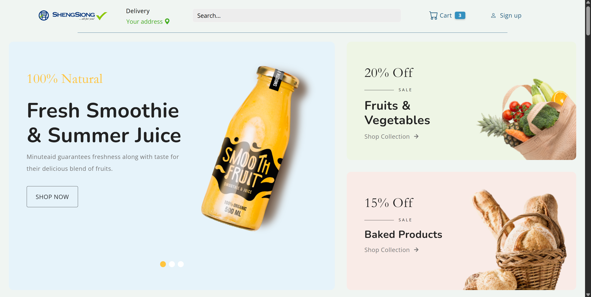
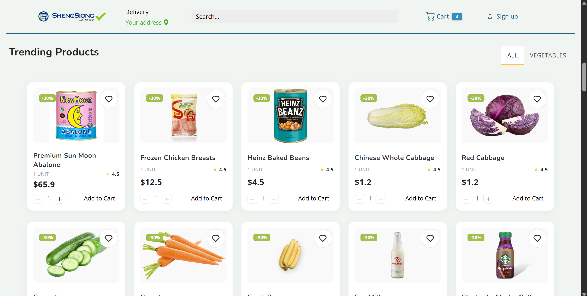
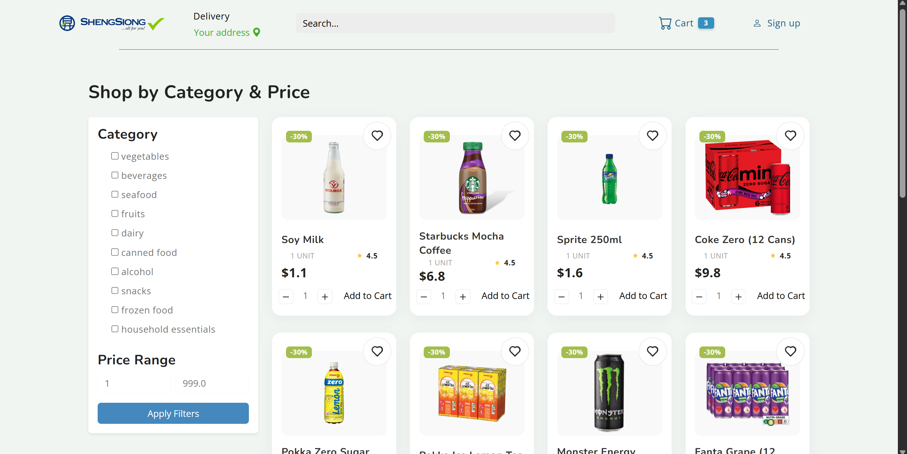
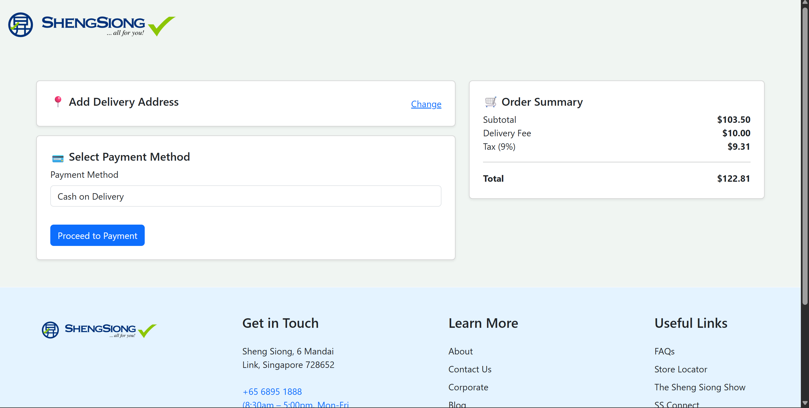
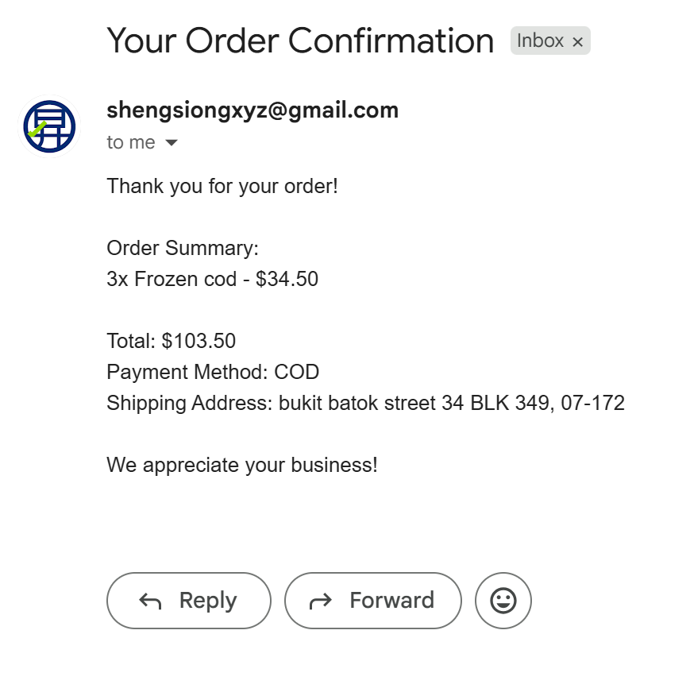
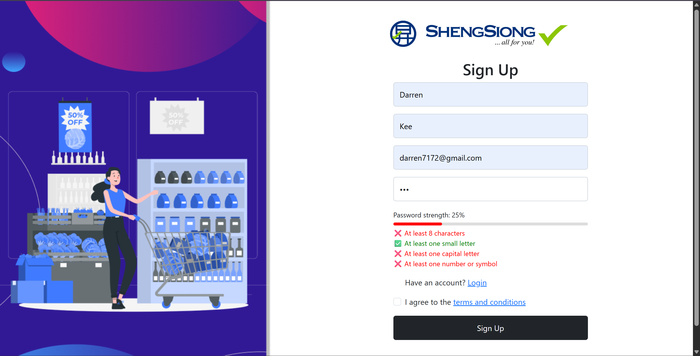
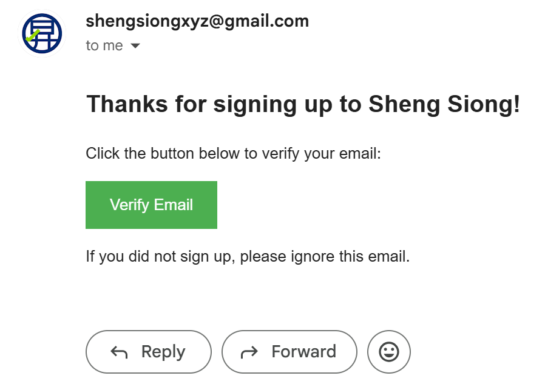

# 🛒 Sheng Siong eCommerce Redesign (Flask Web App)

A full-stack grocery eCommerce prototype built with Flask, inspired by Sheng Siong.  
This project simulates a complete user shopping experience — from browsing groceries to checkout, account creation, and order confirmation — all within a modular Flask app.

> ✅ **Note:** This app is currently not deployed live. 

---

## 📦 Features

- 🔐 **User Authentication**
  - Signup, login, logout
  - Email verification logic 
  - Secure password hashing
  - Unable to route to dashboard via URL
- 🛍️ **Product Display**
  - Homepage product listing
  - Filtered browsing by price and category
  - Dynamically generated product cards using information keyed in from employee side
- 🛒 **Cart & Checkout**
  - Add/remove/update cart items
  - Address input & confirmation
  - Card type detection by javascript
  - Order success screen
  - Email success with order summary
- 📧 **Email Template**
  - Log in and  Order confirmation email structure using Flask-Mail
- 🗂️ **Dashboard**
  - View/update user profile
  - Delete account option validated with password
- **Database**
-  Used SQLite as the lightweight local database and SQLAlchemy as the ORM. I managed models, user auth, and wrote queries to interact with the DB.

---
## 🔧 Tech Stack

- **Frontend**: HTML, CSS, JavaScript (Vanilla), Bootstrap templates
- **Backend**: Python (Flask)
- **Database**: SQLite (via SQLAlchemy ORM)
- **Templating**: Jinja2 (Flask templates)
- **Authentication**: Flask-Login, Email Verification (Optional)
- **Migrations**: Flask-Migrate (Alembic)
- **Deployment**: Local (Video Demo Only)

- --
## 🖼️ Screenshots

  
 
 

---

